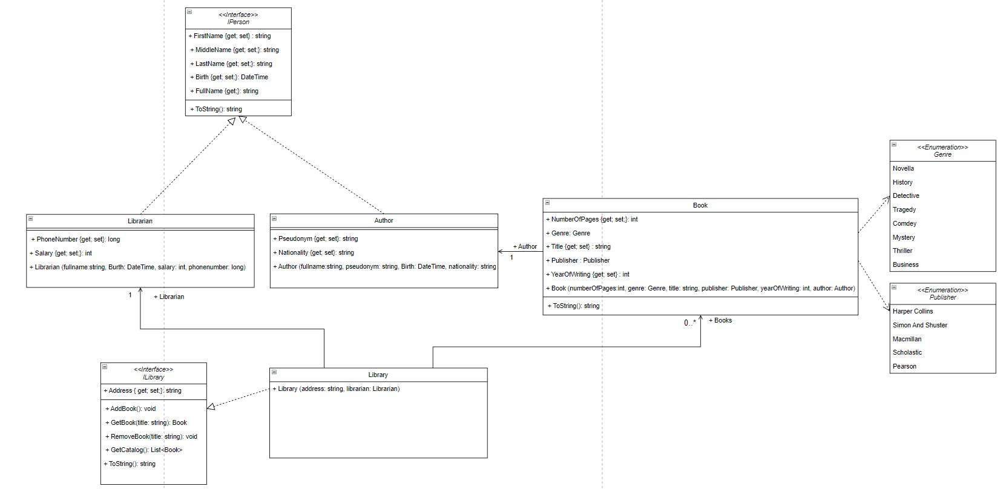

# Project_partA_Dykun

## Опис предметної області - "Бібліотека"

предметна область "Бібліотека" показує зв’язок між бібліотекарями та книгами, які містяться у бібліотеці. 
Предметна область містить інтерфейс `IPerson`, яка описує людину, з властивостями:
- Id (int);
- FirstName (string);
- MiddleName (string);
- LastName (string);
- Birth (DateTime).

Та обчислювальна властивість – FullName (string), а також метод ToString, який буде повертати рядок з описом людини.

Цей інтерфейс реалізують два класи:

1. Перший це бібліотекар (`Librarian`), до нього додаються властивості:
- PhoneNumber (long);
- Salary (int).

А також, конструктор, зі всіма параметрами.

2. Другий клас це автор (`Author`), до нього додаються властивості:
- Pseudonym (string)
- Nationality (string)

І також конструктор зі всіма параметрами.

Клас `Book`, який описує книгу містить властивості:
- NumberOfPages (int);
- Genre (enum, Genre);
- Title (string)
- Publisher (enum, Publisher)
- YearOfWriting (int).

Також він містить конструктор та метод ToString, для виведення інформації про книгу. 
Також, в цьому класі реалізується агрегація, в параметри конструктора Book буде передаватися `Author`.

Останнє це інтерфейс бібліотеки(`ILibrary`) та клас, який його реалізує (`Library`).

Бібліотека містить властивість – Address (string).

Методи:
- Додавання книги (AddBook);
- Отримання книги по назві (GetBook);
- Видалення книги (RemoveBook);
- Отримання всього каталогу книг (GetCatalog);
- Та метод ToString, з виведенням інформації про бібліотеку.

Також в цьому класі реалізується агрегація та композиція, в конструкторі буде параметром передаватися `Librarian`, а також буде створюватися список книг, класу `Book`.

### Проєктування діаграми класів

